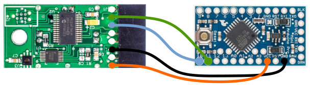
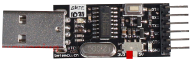
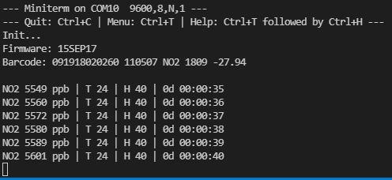
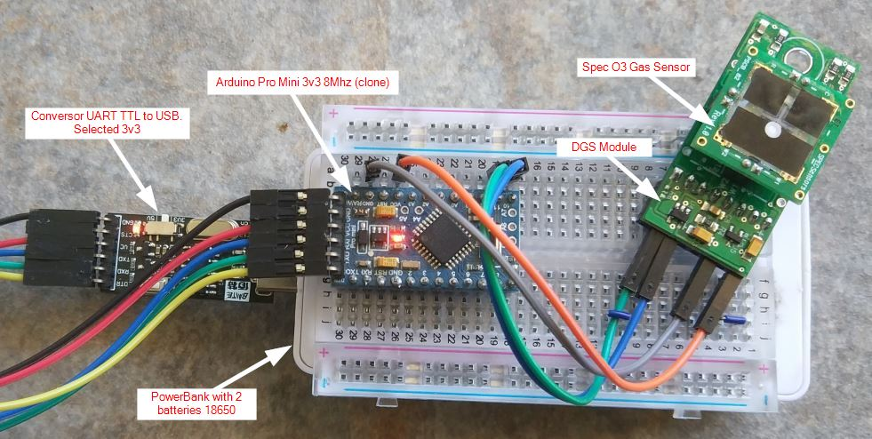
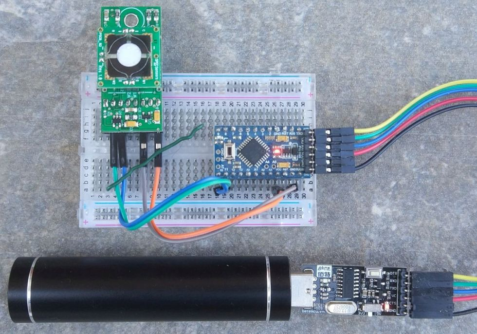
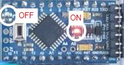

# Auto Calibrate to Zero SPEC-Sensons

## Objetivo
Aplicación cuyo objetivo es realizar un "Set Zero" en un entorno limpio controlado de los sensores SPEC-Sensons. Una vez trancurrido un tiempo inicial de calentamiento se realiza el calibrado a cero del dispositivo.  
Yo suelo montar un Arduino Pro Mini 3v3 8Mhz para realizar dicho cometido.

## Entorno de desarrollo
Uso el VSCode para editar/compilar el código.

## Pasos
- Usar el módulo DGS + USB_UART + Sensor Gas, y conectar a un equipo con OS Windows.
- Establecer con la app DSDK_Tool la asignación del barcode al sensor que deseamos poner a cero.
- Desmontar el USB_UART y conectar a un **Arduino Pro Mini 3v3 8Mhz.** ¿Por qué un Pro Mini?, pues porque el Pro Mini usa 3v3 en los puertos digitales a los que conectamos el RX/TX del Sensor de Gas, y es importante no superar dicho voltaje. Con un Arduino Uno terminaríamos estropeando el sensor. Mi esquema:  
  

- Disponer de un módulo **TTL UART CP2102 USB Converter** para conectar el Arduino al ordenador. Yo uso el modelo Bate que me permite colocarlo a 3v3 y 5v. Dejar seleccionado **3v3**.  
  

- Una vez tenemos el arduino conectado al ordenador usando un módulo USB-UART, compilar el código y pasárselo usando VSCode. Si queremos podemos modificar el tiempo al que debe realizar un **Set Zero**, por ejemplo a "0d 00:05:00" para comprobar que a los 5 minutos nos realiza la operación. El debug está activo por lo que podemos comprobar los resultados por pantalla cuando estamos conectados al ordenador. Ejemplo de log en el VSCode:  
  

- Una vez establecido el tiempo al que queremos que se realice el **Set Zero**, pasar de nuevo el código al arduino y desconectarlo del ordenador.

- Llevar el arduino al sitio que deseamos calibrarlo a cero y conectar el Arduino a un powerbank. También podemos conectarlo a la red eléctrica pero entiendo que lo queremos calibrar en un aire limpio y no hay electricidad cerca.   
Esquema completo de conexiones:  
  
*No todos los powerbanks son válidos,* algunos entran en suspensión cuando el consumo es mínimo y no funcionan.  
Tener cuidado con las conexiones entre el conversor UART y el Arduino. Yo estoy usando un clónico y por mis manos han pasado modelos en el que los pines cambian. Asegurar bien la operación.  
Otra montaje con un powerbank de una única batería 18650:  
  

- Dejar el Arduino durante el tiempo programado (para 8h = "0d 08:00:00") y pasado ese tiempo desconectarlo del powerbank.
¿Cómo podemos saber si ha transcurrido el tiempo?, pues el LED del arduino (interno, normalmente D13) debe estar apagado y el LED de alimentación del arduino encendido. Así quedaría:   
    

Si todos los pasos se han seguido correctamente, ya tenemos el módulo calibrado a 0. Cambiando el "0d 08:00:00" a "0d 23:59:59" podríamos realizar el calibrado después de 24h de exposición. Supuestamente también valdría "1d 00:00:00" pero no lo he dejado tanto tiempo como para asegurar dicho valor.